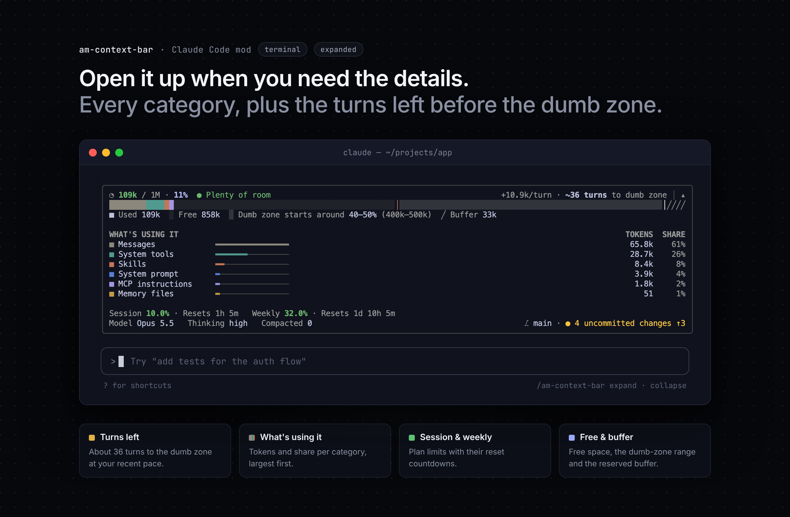
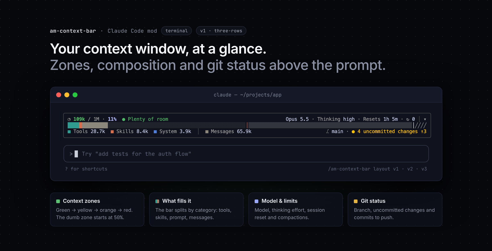
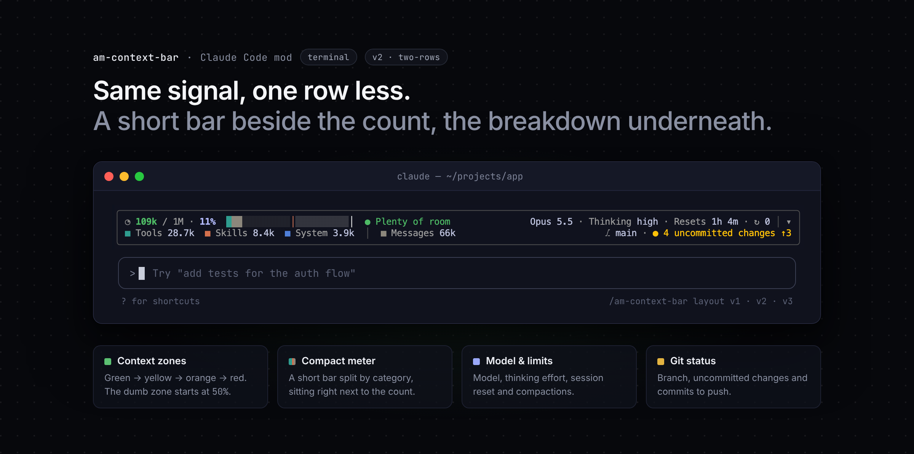
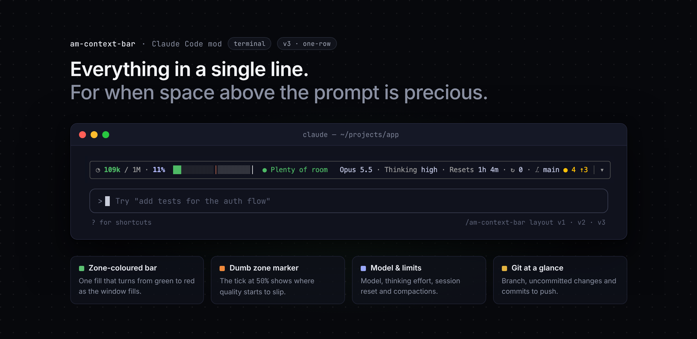

<div align="center">

# claude-am-mods

**Live UI mods for the [Claude Code](https://claude.com/claude-code) terminal.**

[](mods/am-context-bar/.claude-plugin/plugin.json)
[](LICENSE)
[](https://claude.com/claude-code)



</div>

---

## Mods

| Mod | What it does | Command |
| --- | --- | --- |
| [**am-context-bar**](#am-context-bar) | A card above the prompt that shows how full the context window is, what is filling it, how many turns you have left before quality drops, your plan limits, and your git status. | `/am-context-bar` |

---

## am-context-bar

Long sessions slow down and get worse well before the context window is full. **am-context-bar** keeps that in view: a small card that sits above the prompt and updates after every turn. You can keep it collapsed to a line or two, or expand it for the full breakdown.

### At a glance

- **How full the context is**: tokens used out of the window, and the percentage, coloured by zone (green, yellow, orange, red).
- **The dumb zone**: the bar marks where the dumb zone starts (50% by default, where answers tend to get worse) and where auto-compact kicks in.
- **What's filling it**: tools, MCP servers, skills, the system prompt, memory files and your messages, each in its own colour.
- **Runway**: how many tokens each turn adds and how many turns that leaves before the next mark.
- **Plan limits**: session and weekly usage, and when they reset.
- **Session details**: the model, the thinking effort, and how many times the session has been compacted.
- **Git**: the branch, uncommitted changes, and commits to push or pull.
- **Fits in**: three collapsed layouts, theme colours that follow light and dark themes, and your terminal's own background.

### Requirements

- **Claude Code 2.1.289 or later**, in the terminal.
- **A Claude subscription** for the session and weekly limits. With an API key the card still works but has no limits to show.
- **git** on your `PATH` for the git status. Outside a repository the card reads *No git repo*.

### Install

At the Claude Code prompt:

```
/plugin install am-context-bar --marketplace romnycristopher/claude-am-mods
```

Answer `y` to add the marketplace, then pick a scope. User scope turns it on in every session.

Or from a shell:

```sh
claude plugin install am-context-bar --marketplace romnycristopher/claude-am-mods
```

The card starts hidden. Run **`/am-context-bar`** once to show it. It stays on in later sessions until you turn it off.

---

### The collapsed card

The collapsed card is the everyday view. It comes in three layouts, so you can trade detail for space.

#### V1 · three rows (default)



A full-width bar split by category, with a legend underneath.

#### V2 · two rows



A short bar beside the count, with the same legend.

#### V3 · one row



Everything on one line. The bar is a single fill in the zone's colour, so it turns from green to red as the window fills, and the git status shrinks to the branch and a mark.

#### Reading it

| Part | Meaning |
| --- | --- |
| `109k / 1M · 11%` | Tokens in context, the window size and the percentage used. The count takes the zone's colour. |
| `● Plenty of room` | The current [zone](#zones). |
| Bar | The context window. `│` in orange is where the dumb zone starts, `│` in the text colour is auto-compact, and `╱╱` is the reserved buffer after it. |
| Legend | What's using the context. **MCP** combines MCP tools and MCP instructions, **System** combines the system prompt and memory files, and parts under 3% are left out of the legend (they stay in the bar). **Messages**, the part that grows as you talk, always comes last, after a `│`. |
| `Opus 5.5 · Thinking high` | The model, and the thinking effort the last request was sent with (`default` until the first one). |
| `Resets 1h 5m` | When the session limit resets. |
| `↻ 0` | How many times this session has been compacted. |
| `⎇ main · ● 4 uncommitted changes ↑3` | The branch, then `● 4 uncommitted changes` (staged, unstaged and untracked) or `✓ Nothing to commit` on a clean tree. `↑3` counts commits to push and `↓1` commits to pull, when the branch has an upstream. |
| `│ ▾` | Expands the card. |

---

### The expanded card

Press **`▾`** (or run `/am-context-bar expand`) for the full picture. Press **`▴`** to collapse it again.


From top to bottom:

1. **Count and runway.** The runway is the average a turn added over the last five turns, and how many turns like that are left before the dumb zone, then before auto-compact once you're past it. Until a turn has been measured, it shows the tokens left to the next mark instead (`391k to dumb zone`). It starts over after a compaction or a `/clear`.
2. **The bar**, split by category, with the dumb zone shaded and auto-compact marked.
3. **The legend**: tokens used, free space, where the dumb zone starts (a range ten points below the **Dumb zone starts at** setting, since quality tails off rather than dropping at one point), and the buffer reserved for auto-compact.
4. **What's using it**: every category, largest first, with a bar relative to the largest, its tokens and its share of what's used.
5. **Limits**: session (five-hour) and weekly usage, green below 50%, yellow from 50%, orange from 80% and red from 95%, with their reset times.
6. **Session**: the model, the thinking effort and the number of compactions, with the git status at the right.

The expanded card fits the space above the prompt instead of scrolling. On a short terminal it drops its blank spacer lines first, then the blank line above the card, then folds the smallest categories into one **Other** row.

---

### Zones

The count, the status pill and the V3 bar change colour with how full the window is:

| Zone | Default range | Colour |
| --- | --- | --- |
| Plenty of room | under 35% | green |
| Nearing dumb zone | 35–50% | yellow |
| Dumb zone | 50–85% | orange |
| Compact soon | 85% and up | red |

All four colours come from your theme, so they stay readable in light and dark themes. The cut-offs are [settings](#settings).

### Commands

| Command | What it does |
| --- | --- |
| `/am-context-bar` | Shows or hides the card. |
| `/am-context-bar on` · `off` | Shows or hides it explicitly. |
| `/am-context-bar expand` · `collapse` | Opens the expanded or the collapsed view (and shows the card if it's hidden). |
| `/am-context-bar layout v1` · `v2` · `v3` | Picks the collapsed layout. Also accepts `three-rows`, `two-rows`, `one-row`. |

Whether the card is shown and whether it's expanded are remembered across sessions. A `/clear` brings it back collapsed and starts the runway and the compaction count over.

### Settings

Change these in **`/config`**, under am-context-bar:

| Setting | Key | Default | What it does |
| --- | --- | --- | --- |
| Layout | `layout` | `three-rows` | The collapsed layout: `three-rows`, `two-rows` or `one-row`. The same setting `/am-context-bar layout` changes. |
| Nearing dumb zone at (%) | `nearingAt` | `35` | Where the count turns yellow. |
| Dumb zone starts at (%) | `dumbZoneAt` | `50` | Where the dumb zone starts: marked on the bar, and the count turns orange. |
| Compact soon at (%) | `compactSoonAt` | `85` | Where the count turns red. |

The three cut-offs must go up in order (`nearingAt` < `dumbZoneAt` < `compactSoonAt`). If they don't, the card falls back to the defaults.

You can also set them at install time:

```sh
claude plugin install am-context-bar --marketplace romnycristopher/claude-am-mods --config layout=two-rows --config dumbZoneAt=40
```

or in `settings.json`:

```json
{
  "pluginConfigs": {
    "am-context-bar@claude-am-mods": {
      "options": { "layout": "two-rows", "dumbZoneAt": 40 }
    }
  }
}
```

### Privacy

Everything stays on your machine. The card reads the session's own token usage and limits from Claude Code and runs `git rev-parse` and `git status` in the working directory. It makes no network requests and sends nothing anywhere.

---

## License

[MIT](LICENSE) © Romny Cristopher
